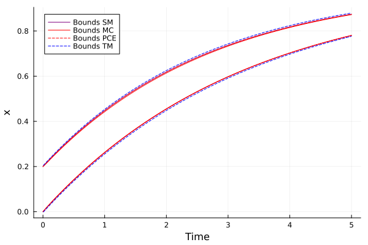
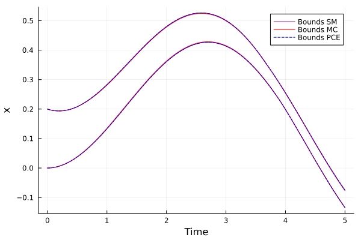
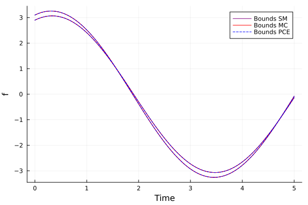

# IntervalSimulations.jl

**IntervalSimulations.jl** is a Julia package for simulating differential equations with uncertain parameters and initial conditions. Built on top of [ModelingToolkit.jl](https://mtk.sciml.ai/), it enables easy propagation of uncertainty using multiple methods:

* 🧮 Polynomial Chaos Expansion (PCE)
* 🎲 Monte Carlo sampling
* 📊 Parameter grid scanning
* 🌀 Taylor model reachability (via ReachabilityAnalysis.jl)

The package is designed to support symbolic models with interval-valued inputs, automate solver setup, and provide clear uncertainty bounds across time.

📄 [Read the accompanying thesis (PDF)](thesis.pdf)

---

## Installation

```julia
using Pkg
Pkg.add(url="https://github.com/yourusername/IntervalSimulations.jl")
```

---

## High-Level Examples

### Example 1: First-Order System with Uncertain Time Constant and Initial Condition

We start by building a simple first-order lag system. The model includes uncertainty in both the time constant `τ` and the initial condition for the state `x(t)`. This uncertainty is specified directly in the model definition using interval syntax:

```julia
using ModelingToolkit
using ModelingToolkit: t_nounits as t, D_nounits as D
using IntervalSimulations

@mtkmodel FOL begin
    @parameters begin
        τ = 3.0±0.3 # uncertain time constant
    end
    @variables begin
        x(t) = 0.1±0.1 # uncertain initial condition
    end
    @equations begin
        D(x) ~ (1 - x) / τ
    end
end

@mtkbuild fol = FOL()
```

Once the system is defined, we can analyze its behavior under uncertainty using several different methods:

#### Scanning

Grid scanning evaluates the model at evenly spaced values across each uncertain parameter range.

```julia
scan_sol = solve_parameter_scan(fol, [0.0, 5.0], 10)
scan_bounds = compute_bounds(scan_sol, idxs=fol.x)
fig = plot_solution(scan_bounds, label="Bounds SM", color = :purple)
```

#### Monte Carlo

Monte Carlo sampling draws many random parameter combinations and simulates the resulting trajectories.

```julia
mc_sol = solve_monte_carlo(fol, [0.0, 5.0], 1000)
mc_bounds = compute_bounds(mc_sol, idxs=fol.x)
plot_solution!(fig, mc_bounds, label="Bounds MC", color = :red)
```

#### Polynomial Chaos Expansion (PCE)

PCE approximates the uncertain output as a sum of orthogonal polynomials in the uncertain parameters.

```julia
pce_sol = solve_pce(fol, [0.0, 5.0], poly_order = 3)
pce_bounds = calculate_bounds_pce(pce_sol, idxs=fol.x, ia = false)
plot_solution!(fig, pce_bounds, label="Bounds PCE", color = :blue)
```

#### Taylor Model Reachability

Validated simulation using Taylor models produces guaranteed overapproximations of reachable states.

To support this, the function createIVP attempts to convert a symbolic ModelingToolkit system into an InitialValueProblem suitable for ReachabilityAnalysis.jl. It extracts initial intervals, simplifies equations, and resolves algebraic constraints. However, note that this transformation currently fails if the model includes time-dependent expressions (e.g., sin(t) in the RHS), and may be sensitive to other modeling patterns as well.

```julia
using ReachabilityAnalysis
@named sys = FOL()
ivp = createIVP(sys)

taylor_sol = solve_reachability(ivp, (0.0, 5.0), 
                                solver = TMJets21b(abstol=1e-20, 
                                                    maxsteps =100000,
                                                    adaptive=true))
taylor_bounds = get_bounds(taylor_sol, idxs=[1])
plot_solution!(fig, taylor_bounds, label="Bounds TM", color = :black)
plot!(ylabel="x", xlabel="Time")
```

The resulting plot compares all methods in a unified view. Scanning and Monte Carlo provide empirical bounds, PCE gives a fast and smooth approximation, and Taylor models give rigorous enclosures with mathematical guarantees. In this example, the bounds from Monte Carlo, Scanning, and PCE lie nearly on top of each other, and are visually indistinguishable in the plot.



### Example 2: System with Time-Dependent Input

This example demonstrates that IntervalSimulations.jl can handle time-dependent expressions in the model. Here, `f(t)` is defined as a sine wave and used in the differential equation:

```julia
using ModelingToolkit
using ModelingToolkit: t_nounits as t, D_nounits as D
using IntervalSimulations

@mtkmodel FOL begin
    @parameters begin
        τ = 3.0±0.1
    end
    @variables begin
        x(t) = 0.1±0.1
        f(t)
    end
    @equations begin
        f ~ sin(t)
        D(x) ~ (f - x) / τ
    end
end

@mtkbuild fol_variable_f = FOL()

```
This model can be simulated using the scanning, Monte Carlo, and PCE methods:

```julia
scan_sol = solve_parameter_scan(fol_variable_f, [0.0, 5.0], 10)
scan_bounds = compute_bounds(scan_sol,idxs=fol_variable_f.x)
fig=plot_solution(scan_bounds, color = :purple)

mc_sol = solve_monte_carlo(fol_variable_f, [0.0, 5.0], 1000)
mc_bounds = compute_bounds(mc_sol,idxs=[fol_variable_f.x])
fig=plot_solution!(fig,mc_bounds, color = :red)

pce_sol = solve_pce(fol_variable_f, [0.0, 5.0], poly_order = 5)
pce_bounds = calculate_bounds_pce(pce_sol,idxs=fol_variable_f.x, ia=false)
fig = plot_solution!(fig, pce_bounds,idxs=fol_variable_f.x, color =:blue)
plot!(ylabel="x", xlabel="Time")
```
⚠️ Taylor model reachability is not supported for this example, since the current createIVP logic does not handle time-dependent expressions like sin(t) in the equations.



### Example 3: Uncertain Output from a Time-Driven System

In this example, the system state `x(t)` is directly defined as a time-dependent expression (`x ~ sin(t)`), and the unknown quantity `f(t)` is inferred from the dynamics. We are interested in computing uncertainty bounds for `f(t)`.

```julia
using ModelingToolkit
using ModelingToolkit: t_nounits as t, D_nounits as D
using IntervalSimulations

@mtkmodel FOL begin
    @parameters begin
        τ = 3.0±0.1
    end
    @variables begin
        x(t)
        f(t)
    end
    @equations begin
        x ~ sin(t)
        D(x) ~ (f - x) / τ
    end
end

@mtkbuild fol_variable_f = FOL()
```
Even though x(t) is explicitly defined over time, the system still supports analysis of uncertainty in f(t) using scanning, Monte Carlo, and PCE:
```julia
scan_sol = solve_parameter_scan(fol_variable_f, [0.0, 5.0], 10)
scan_bounds = compute_bounds(scan_sol, idxs=fol_variable_f.f)
fig = plot_solution(scan_bounds, label="Bounds SM", color = :purple)

mc_sol = solve_monte_carlo(fol_variable_f, [0.0, 5.0], 1000)
mc_bounds = compute_bounds(mc_sol, idxs=[fol_variable_f.f])
plot_solution!(fig, mc_bounds, label="Bounds MC", color = :red)

pce_sol = solve_pce(fol_variable_f, [0.0, 5.0], poly_order = 3)
pce_bounds = calculate_bounds_pce(pce_sol, idxs=fol_variable_f.f, ia=false)
plot_solution!(fig, pce_bounds, label="Bounds PCE", color = :blue)
```
⚠️ Taylor model reachability is not applicable for this setup, both due to the explicit time dependence and because bounds are being extracted for an observed variable, which is not supported by createIVP.


[](https://github.com/rasmus.kovacs/IntervalSimulations.jl/actions/workflows/CI.yml?query=branch%3Amain)
